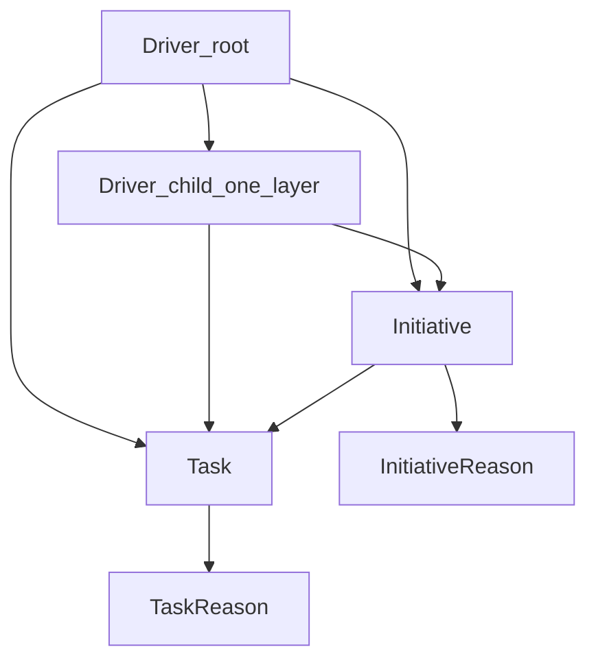

# System Design — Tasks, Initiatives, Drivers

## Scope

This document describes the current domain design and API behavior for Momentum after the primitives refactor.

Canonical primitives:

- `task`
- `initiative`
- `driver`
- `reason`

## Mental model

## Entity responsibilities

### Task

A concrete action in the world to execute one or more times.

Key features:

- status/priority lifecycle
- optional initiative link (`initiative_id`)
- due window (`due_start_at`, `due_end_at`)
- recurrence metadata
- checklist items (`checklist_json`)
- multi-driver links

### Initiative

A larger stream of work that can own many task children.

Key features:

- state lifecycle (`active`, `paused`, `completed`, `abandoned`, `archived`)
- optional due window
- multi-driver links
- free-text reasons

### Driver

Top-level categorization for responsibility and decision framing.

Types:

- `obligation`
- `risk`
- `leverage`
- `surplus`

Hierarchy constraint:

- one optional subdriver layer only (`parent_driver_id`)

## Hard constraints

- Tasks do not require an initiative.
- Drivers and initiatives in archived/deleted state cannot be newly linked.
- Driver hierarchy depth is capped at one child layer.
- Soft-delete/archive is default; hard-delete requires explicit confirmation.
- Every write emits an immutable audit event.
- Entity versions increment on updates.

## API design

All routes are prefixed with `/v1`.

### Drivers

- CRUD + archive/hard-delete
- tree endpoint for root/child rendering

### Initiatives

- CRUD + archive/hard-delete
- driver link/unlink endpoints
- reason CRUD endpoints

### Tasks

- CRUD + archive/hard-delete
- driver link/unlink endpoints
- reason CRUD endpoints
- list filters include `initiative_id`, `driver_id`, `status`, `priority`, `query`

## Operational model

- Backend stack: FastAPI + SQLAlchemy + Postgres
- Frontend stack: React + TypeScript + React Query
- Auth: Cloudflare Access (or dev header mode locally)
- Deployment: Docker Compose on single VPS behind Cloudflare Tunnel

## Clean-break migration policy

The primitives refactor intentionally does **not** transform legacy data.

Cutover checklist:

1. Backup old DB if historical snapshot is needed.
2. Recreate database/volume for clean schema.
3. Start services with current code.
4. Validate health and create fresh drivers/initiatives/tasks.

No legacy compatibility layer is maintained for prior domain primitives.
